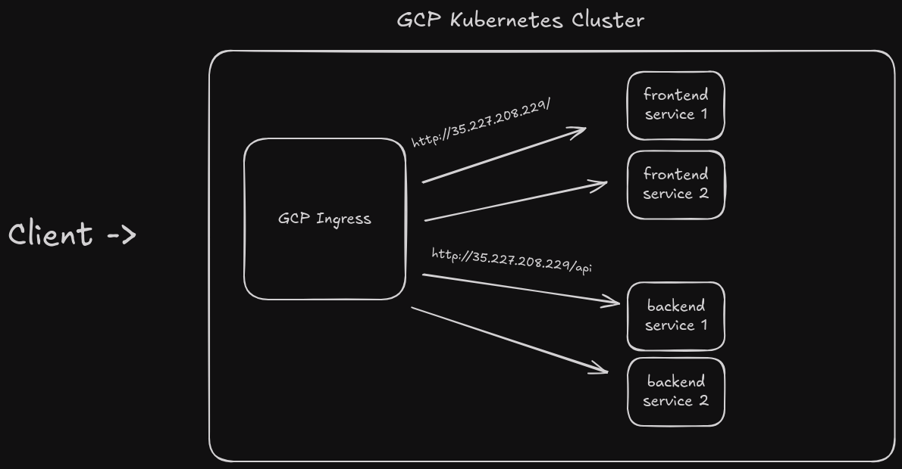

# Animal Farm Project

A modern web application inspired by George Orwell's Animal Farm, built with Angular (frontend) and NestJS (backend).

### System Design


system design

## 🚀 Features

- Angular-based frontend with modern UI
- NestJS backend with RESTful API
- Multiple deployment options (Docker Compose, Kubernetes, Cloud)
- Nginx reverse proxy
- SQLite database for data persistence

## 🔧 Prerequisites

Before you begin, ensure you have the following installed:
- [Docker](https://docs.docker.com/get-docker/) (version 20.10.0 or higher)
- [Docker Compose](https://docs.docker.com/compose/install/) (version 1.29.0 or higher)
- [Minikube](https://minikube.sigs.k8s.io/docs/start/) (for local Kubernetes)
- [kubectl](https://kubernetes.io/docs/tasks/tools/) (for Kubernetes)

## 🏃‍♂️ Running the Application

### Option 1: Docker Compose (Simplest)

1. Clone the repository:
```bash
git clone https://github.com/yourusername/animal-farm.git
cd animal-farm
```

2. Build and start the containers:
```bash
docker-compose up --build
```

The application will be available at:
- Frontend: http://localhost:4200
- Backend API: http://localhost:3000

To stop the application:
```bash
docker-compose down
```

### Option 2: Local Kubernetes with Minikube

1. Start Minikube:
```bash
minikube start
minikube addons enable ingress
```

2. Point your shell to minikube's Docker daemon:
```bash
eval $(minikube docker-env)
```

3. Build the images:
```bash
docker build -t animal-farm-frontend:latest ./animal-farm-frontend
docker build -t animal-farm-backend:latest ./animal-farm-backend
```

4. Create data directory:
```bash
minikube ssh
sudo mkdir -p /data/animal-farm
sudo chmod 777 /data/animal-farm
exit
```

5. Deploy to Kubernetes:
```bash
# Create namespace first
kubectl apply -f k8s/namespace.yaml

# Apply all configurations
kubectl apply -k k8s/
```

6. Add host entry:
```bash
echo "$(minikube ip) animal-farm.local" | sudo tee -a /etc/hosts
```

The application will be available at:
- Frontend: http://animal-farm.local
- Backend API: http://animal-farm.local/api

Useful Kubernetes commands:
```bash
# View resources
kubectl get all -n animal-farm

# View logs
kubectl logs -n animal-farm -l app=frontend
kubectl logs -n animal-farm -l app=backend

# Delete everything
kubectl delete namespace animal-farm
```

### Option 3: Cloud Deployment (GCP)

Prerequisites:
- [Terraform](https://www.terraform.io/downloads.html)
- [Google Cloud SDK](https://cloud.google.com/sdk/docs/install)
- GCP Project with billing enabled

1. Initialize Terraform:
```bash
cd terraform
terraform init
```

2. Create terraform.tfvars:
```hcl
project_id = "your-project-id"
region     = "us-central1"
```

3. Deploy to GCP:
```bash
terraform apply
```

4. Configure kubectl:
```bash
gcloud container clusters get-credentials animal-farm-cluster \
    --region $(terraform output -raw region) \
    --project $(terraform output -raw project_id)
```

5. Deploy the application:
```bash
kubectl apply -k k8s/
```

## 🏗️ Project Structure

```
animal-farm/
├── animal-farm-frontend/     # Angular frontend
├── animal-farm-backend/      # NestJS backend
├── k8s/                      # Kubernetes manifests
├── terraform/                # Terraform configurations
├── data/                     # SQLite database storage
├── docker-compose.yml        # Docker Compose config
└── README.md                 # This file
```

## 📝 Environment Variables

Backend:
- `NODE_ENV`: Set to 'production' in deployment
- `PORT`: Optional, defaults to 3000

Frontend:
- Environment configuration in src/environments/

## 🔒 Security

- Non-root users in containers
- CORS configuration
- Nginx reverse proxy
- Kubernetes network policies
- Cloud security best practices

## 📦 Technologies

- Frontend: Angular 16+, TypeScript, SCSS
- Backend: NestJS, TypeScript, SQLite
- DevOps: Docker, Kubernetes, Terraform, GCP
- Infrastructure: Nginx, Cloud SQL (optional)

## 📄 License

This project is licensed under the MIT License - see the LICENSE file for details

